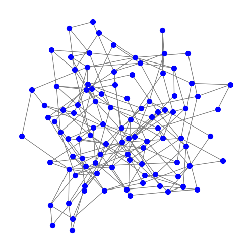

# Small-World Network Analysis

## Student Information

- **Name**: Ismayilzada Ismayil
- **Neptun Code**: DGY785
- **Course Code**: BMEVITMMA03
- **Course Name**: Modeling Seminar for Engineer
- **Professor**: Péter Babarczi
- **Institution**: Budapest University of Technology and Economics

## Network Science - Small World (Exam)

This is a task for Modeling Seminar subject at BME university.

### Task description

Reproduce some results of a seminal paper in network science.
Read the paper and implement the model in an arbitrary programming language! Generate three networks with different p values! Compare the properties (diameter, clustering and degree distribution) of these networks with the Internet! Submit your code, results, plots and conclusions in a single PDF file.

## Deep Dive into the Inspiration: "Collective dynamics of ‘small-world’ networks"

### A Game-Changing Paper by Duncan J. Watts and Steven H. Strogatz

#### The Big Idea

Ever wondered how everyone seems to be connected by just a few degrees of separation? That's what Watts and Strogatz got me thinking about. Their groundbreaking paper isn't just another academic read; it's a journey into understanding the fascinating world of networks that we're all a part of – from the friends we make to the neurons firing in our brains.

#### The Three versions of Networks

1. **Regular Networks**: Imagine a neat, orderly neighborhood. Everyone's connected to their immediate neighbors. Cozy, but it takes ages to get a message across town.
2. **Random Networks**: Now picture a city where everyone throws messages in bottles into a river, hoping it reaches someone. It's quick, but super chaotic.
3. **Small-World Networks**: Here's the cool part – Watts and Strogatz showed us there's a middle ground. Networks can be like a small town where you know your neighbors, but some have friends in far-off places. You get the best of both worlds – tight-knit clusters with short paths linking them.

#### Their Special Recipe

This duo came up with a clever way to tweak networks from orderly to random with just a dial – the rewiring probability `p`. It's like adjusting the randomness in our hypothetical town's social structure.

#### Why It's a Big Deal

This paper isn't just theory; it's a lens to see the world. It helps explain why diseases spread the way they do, how our brains might be wired, and even why Kevin Bacon seems connected to every actor in Hollywood. It's a cornerstone in network science that has fueled countless other discoveries.

#### My Takeaway

Reading this paper was like getting new glasses – everything just clicked into place. It's a masterclass in how simplicity can unravel complexity, and it's the bedrock of what I'm exploring in my project.

## Overview of the project

This project is inspired by the seminal paper "Collective dynamics of ‘small-world’ networks" by Duncan J. Watts and Steven H. Strogatz. The paper introduces the concept of small-world networks, which are neither completely regular nor entirely random, but rather exhibit properties of both. These networks are characterized by higher clustering and shorter path lengths, making them a subject of interest in various fields including sociology, physics, and computer science.

## Goals and Motivation

The primary goal of this project is to explore and understand the properties of small-world networks as described by Watts and Strogatz. By generating networks with varying parameters and analyzing their properties, the project aims to gain insights into how small-world networks function and how they compare to other types of networks, particularly the Internet.

## What Does the Project Do?

The project involves:

1. Generating small-world networks using the Watts-Strogatz model with different parameters (number of nodes `n`, number of nearest neighbors `k`, and rewiring probability `p`).
2. Calculating key properties of these networks, such as diameter, clustering coefficient, and degree distribution.
3. Saving the calculated properties into CSV and TXT files for further analysis.
4. Optionally, plotting these networks for visual inspection.

## How to Run the Code

To run the code, follow these steps:

1. Ensure you have Python installed on your system along with the `networkx` and `matplotlib` libraries.
2. Place the script in your desired directory.
3. Run the script using Python:
`py small_world.py`
4. The script will generate networks with predefined `n`, `k`, and `p` values, calculate their properties, and save the results in `network_properties.csv` and `network_properties.txt`. Optionally, it will also display plots of these networks.
5. You can modify the `n_values`, `k_values`, and `p_values_list` in the script to generate networks with different parameters.

## Code Explanation and Methods

This project implements a Python script that generates small-world networks using the Watts-Strogatz model, analyzes their properties, and visualizes their structures. Below is a detailed explanation of the core functions within the script:

### `create_small_world_network(n, k, p)` Function

This function generates a small-world network based on the following parameters:

- `n`: Number of nodes in the network.
- `k`: Each node is connected to `k` nearest neighbors in a ring topology before rewiring.
- `p`: Probability of rewiring each edge, which introduces randomness into the network.

The function returns a network `G` constructed according to the Watts-Strogatz model, facilitating the study of small-world phenomena.

### `network_properties(G)` Function

This function calculates the following properties of a given network `G`:

- **Diameter**: The longest shortest path between any two nodes. If `G` is disconnected, the diameter is considered infinite.
- **Clustering Coefficient**: Measures the degree to which nodes tend to cluster together. A higher value indicates a more tightly-knit group of nodes.
- **Degree Distribution**: The distribution of connections each node has, represented by the frequency of each degree in the network.

The properties are essential for understanding the nature of the network and are used for comparison with real-world data such as Internet topology.

### `small_world(n, k, p_values)` Function

The main driver function that:

- Generates networks with varying `p` values using the `create_small_world_network` function.
- Calls `network_properties` to compute network properties for each generated network.
- Uses `matplotlib` to plot each network for visual analysis, highlighting the impact of `p` on the network's structure.
- Stores the calculated properties for further analysis or comparison with networks such as the Internet.

### Visualization and Analysis

The script includes a plotting routine to visualize the networks' structures, which is invaluable for intuitively understanding the impact of the Watts-Strogatz model's parameters. These visualizations complement the numerical analysis and provide a direct way to observe the transition from regular lattices to random networks as `p` increases.

To generate the visualizations and analyze the network properties, ensure to run the script and refer to the detailed results in the subsequent sections of this README.

---

This code forms the basis of our exploration into the structural dynamics of small-world networks and their comparison to real-world network topologies like the Internet.

## Results

### Summary of Results

- **Diameter**: As P increases, the diameter tends to decrease, indicating that the average shortest path between two nodes gets smaller, which is characteristic of the small-world phenomenon.
- **Clustering Coefficient**: The clustering coefficient decreases with higher P values, suggesting that the network transitions from a highly clustered structure to a more random one.
- **Degree Distribution**: The diversity in node degrees increases with P, moving from a uniform distribution at P=0 (indicating a regular network) to a more varied distribution at P=1 (indicating a random network).

### Detailed Results

| Network Name | N   | K | P   | Diameter | Clustering Coefficient | Degree Distribution     |
|--------------|-----|---|-----|----------|------------------------|-------------------------|
| Network_0    | 50  | 5 | 0   | 13       | 0.5                    | 4:50                    |
| Network_0.1  | 50  | 5 | 0.1 | 9        | 0.44333333333333336    | "2:1, 3:3, 4:41, 5:5"          |
| Network_1    | 50  | 5 | 1   | 5        | 0.11376190476190474    | "2:8, 3:15, 4:10, 5:7, 6:7, 7:2, 8:1" |
| Network_0    | 100  | 5 | 0   | 25       | 0.5                    | 4:100                    |
| Network_0.1  | 100  | 5 | 0.1 | 10       | 0.36633333333333334    | "3:13, 4:74, 5:13"          |
| Network_1    | 100  | 5 | 1   | 7        | 0.010277777777777776    | "2:10, 3:28, 4:29, 5:22, 6:9, 7:1, 9:1" |

## Network Topology Visualizations

### Generating the Plots

To reproduce the visualizations of the network topologies, you will need to run the `plot.py` file. This script will generate the networks with varying numbers of nodes and rewiring probabilities, then create and save the corresponding plots as images.

`py plot.py`

### Understanding Network Dynamics Through Visualization

Visualizing the networks gives us an intuitive grasp of the structural differences introduced by varying the rewiring probability `p`. Below are two sets of visualizations depicting networks with 50 and 100 nodes, respectively.

#### Networks with 50 Nodes

*Figure 1: Regular lattice (p=0) with 50 nodes. Nodes are connected to their nearest neighbors, forming a structured pattern without shortcuts.*

*Figure 2: Small-world network (p=0.1) with 50 nodes. Notice the introduction of a few long-range edges (shortcuts) which significantly reduce the average path length.*

*Figure 3: Random network (p=1) with 50 nodes. The network loses its regular structure entirely, with edges rewired randomly across the graph.*

#### Networks with 100 Nodes

*Figure 4: Regular lattice (p=0) with 100 nodes. Similar to Figure 1, but with more nodes, the pattern is a little harder to see.*

*Figure 5: Small-world network (p=0.1) with 50 nodes. As with Figure 2, shortcuts are visible, altering the network's character and connectivity.*

*Figure 6: Random network (p=1) with 50 nodes. This network shares the randomness of Figure 3 but on a bigger scale.*

In our experiments, we've generated networks with varying numbers of nodes (N), each connected to a fixed number of nearest neighbors (K), and subjected to different probabilities of rewiring (P). The results reveal how these parameters influence the network's diameter, clustering coefficient, and degree distribution. Below is a summary of our findings:

## Comparison with Internet Network Properties

The Internet is often modeled as a scale-free network, which displays characteristic properties such as a small diameter, high clustering coefficient, and a power-law degree distribution. Below is a comparison of the properties of our generated networks with typical Internet network properties:

### Diameter

- **Internet**: Characterized by a small diameter due to its scale-free nature with highly connected hub nodes.
- **Generated Networks**: The diameter decreases as we increase the rewiring probability `p`. For instance, the network with `N=50, K=10, P=0` has a diameter of 5, which grows to 25 for `N=100, K=4, P=0`. As `p` increases to 1, we see a diameter reduction to as low as 3 for `N=100, K=10, P=1`, which suggests a small-world characteristic similar to the Internet's structure.

### Clustering Coefficient

- **Internet**: Exhibits a higher clustering coefficient, indicative of the tendency to form clusters or tightly knit groups.
- **Generated Networks**: We observe a clustering coefficient that is high in regular networks (e.g., 0.5 for `N=50, K=5, P=0`) and declines with increasing `p`, reflecting a transition to a more random network structure. For instance, the clustering coefficient drops to 0.113 for `N=50, K=5, P=1`.

### Degree Distribution

- **Internet**: Follows a power-law distribution where a few nodes have a very high degree, and many have a low degree.
- **Generated Networks**: The degree distribution in regular networks (P=0) is uniform (e.g., all nodes have a degree of 4 for `N=50, K=4, P=0`), reflecting a highly structured network. As `p` increases, the distribution becomes more varied, but it does not follow the power-law distribution seen in the Internet. For example, in the network with `N=100, K=10, P=1`, we have a range of degrees from 5 to 14, which indicates more randomness but not the scale-free property.

### Conclusion

The Watts-Strogatz model networks, at low `p` values, share some similarities with the Internet, such as small diameters and relatively high clustering. However, as `p` increases, the network properties diverge, particularly in the degree distribution, which does not exhibit the Internet's scale-free characteristics. This comparison provides insight into how varying the Watts-Strogatz model parameters can produce networks with some small-world properties akin to the Internet but also highlights the distinct differences arising from the Internet's scale-free nature.

## Dependencies

- Python 3.x
- networkx
- matplotlib
- numpy
- csv

---

*This README is a guide to understanding and running the Small-World Network Analysis project, and it provides a brief overview of the motivating paper and the objectives of the project.*
